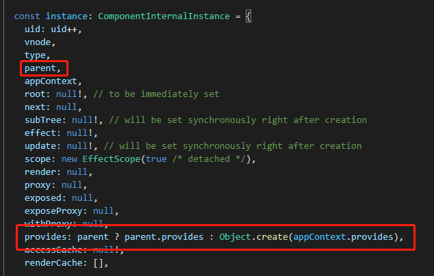

# Vue3 的 Provide / Inject 的实现原理

Vue3 的 Provide / Inject 的实现原理其实就是巧妙利用了原型和原型链的来实现的，所以在了解Vue3 的 Provide / Inject 的实现原理之前，我们先复习一下原型和原型链的知识。

### 原型和原型链的知识回顾

-  prototype 与 `__proto__`


prototype 一般称为显式原型，`__proto__`一般称为隐式原型。 每一个函数在创建之后，在默认情况下，会拥有一个名为 prototype 的属性，这个属 性表示函数的原型对象。

- 原型链 

当我们访问一个JS对象属性的时候，JS先会在这个对象定义的属性里找，找不到就会沿着这个对象的`__proto__`这个隐式原型关联起来的链条向上一个对象查找，这个链条就叫原型链。

```javascript
function Fn() {}
Fn.prototype.name = 'coboy'
let fn1 = new Fn()
fn1.age = 18
console.log(fn1.name) // coboy
console.log(fn1.age) // 18
```

fn1是Fn函数new出来的实例对象，fn1.age是这个实例对象上属性，fn1.name则从Fn.prototype原型对象而来，因为fn1的`__proto__`隐式原型就是指向Fn这个函数的原型对象Fn.prototype。原型链某种意义上是让一个引用类型继承另一个引用类型的属性和方法。

```javascript
function Fn() {}
Fn.prototype.name = 'coboy'
let fn1 = new Fn()
fn1.name = 'cobyte'
console.log(fn1.name) // cobyte
```

当访问fn1这个实例对象的属性name的时候，JS先会在fn1这个实例对象的属性里查找，刚好fn1定义了一个name属性，所以就直接返回自身属性的值cobyte，否则就会继续沿着原型链向Fn.prototype上去找，那么就会返回coboy。

复习完原型和原型链的知识之后，我们就开始进入Provide/Inject的实现原理探索。

### 使用 Provide

在 `setup()` 中使用 `provide` 时，我们首先从 `vue` 显式导入 `provide` 方法。这使我们能够调用 `provide` 来定义每个 property。

`provide` 函数允许你通过两个参数定义 property

1. name (`<String>` 类型)
2. value

```javascript
import { provide } from 'vue'

export default {
  setup() {
    provide('name', 'coboy')
  }
}
```

### provide API实现原理

那么这个provide API实现原理是什么呢？

provide 函数可以简化为

```javascript
export function provide(key, value) {
    // 获取当前组件实例
    const currentInstance: any = getCurrentInstance()
    if(currentInstance) {
        // 获取当前组件实例上provides属性
        let { provides } = currentInstance
        // 获取当前父级组件的provides属性
        const parentProvides = currentInstance.parent.provides
        // 如果当前的provides和父级的provides相同则说明还没赋值
        if(provides === parentProvides) {
            // Object.create() es6创建对象的另一种方式，可以理解为继承一个对象, 添加的属性是在原型下。
            provides = currentInstance.provides = Object.create(parentProvides)
        }
        provides[key] = value
    }
}
```

综上所述provide API就是通过获取当前组件的实例对象，传进来的数据存储在当前的组件实例对象上的provides上，并且通过ES6的新API Object.create把父组件的provides属性设置到当前的组件实例对象的provides属性的原型对象上。

`provides = currentInstance.provides = Object.create(parentProvides)` 发生了什么？

首先 `Object.create(parentProvides)` 创建了一个新的对象引用，如果只是把 `currentInstance.provides` 更新为新的对象引用，那么`provides`的引用还是旧的引用，所以需要同时把`provides`的引用也更新为新的对象引用。

### 实例对象初始化时provides属性的处理

源码位置：runtime-core/src/component.ts

 

我们通过查看instance对象的源码，可以看到，在instance组件实例对象上，存在parent和provides两个属性。在初始化的时候如果存在父组件则把父组件的provides赋值给当前的组件实例对象的provides，如果没有就创建一个新的对象，并且把应用上下文的provides属性设置为新对象的原型对象上的属性。

### 使用 inject

在 `setup()` 中使用 `inject` 时，也需要从 `vue` 显式导入。导入以后，我们就可以调用它来定义暴露给我们的组件方式。

`inject` 函数有两个参数：

1. 要 inject 的 property 的 name
2. 默认值 (**可选**)

```javascript
import { inject } from 'vue'

export default {
  setup() {
    const name = inject('name', 'cobyte')
    return {
      name
    }
  }
}
```

### inject API实现原理

那么这个inject API实现原理是什么呢？

inject 函数可以简化为

```javascript
export function inject(
  key,
  defaultValue,
  treatDefaultAsFactory = false
) {
  // 获取当前组件实例对象
  const instance = currentInstance || currentRenderingInstance
  if (instance) {
    // 如果intance位于根目录下，则返回到appContext的provides，否则就返回父组件的provides
    const provides =
      instance.parent == null
        ? instance.vnode.appContext && instance.vnode.appContext.provides
        : instance.parent.provides

    if (provides && key in provides) {
      return provides[key]
    } else if (arguments.length > 1) {
      // 如果存在1个参数以上
      return treatDefaultAsFactory && isFunction(defaultValue)
        // 如果默认内容是个函数的，就执行并且通过call方法把组件实例的代理对象绑定到该函数的this上
        ? defaultValue.call(instance.proxy) 
        : defaultValue
    }
  }
}
```

通过inject源码分析我们可以知道，inject里面先获取当前组件的实例对象，然后判断是否根组件，如果是根组件则返回到appContext的provides，否则就返回父组件的provides。

如果当前获取的key在provides上有值，那么就返回该值，如果没有则判断是否存在默认内容，默认内容如果是个函数，就执行并且通过call方法把组件实例的代理对象绑定到该函数的this上，否则就直接返回默认内容。

### provide/inject实现原理总结

通过上面的分析，可以得知provide/inject实现原理还是比较简单的，就是巧妙地利用了原型和原型链的进行数据的继承和获取。provide API调用设置的时候，设置父级的provides为当前provides对象原型对象上的属性，在inject获取provides对象中的属性值时，优先获取provides对象自身的属性，如果自身查找不到，则沿着原型链向上一个对象中去查找。


### 拓展：Object.create原理 

方法说明 

- Object.create()方法创建一个新的对象，并以方法的第一个参数作为新对象的`__proto__`属性的值（以第一个参数作为新对象的构造函数的原型对象） 
- Object.create()方法还有第二个可选参数，是一个对象，对象的每个属性都会作为新对象的自身属性，对象的属性值以descriptor（Object.getOwnPropertyDescriptor(obj, 'key')）的形式出现，且enumerable默认为false 

源码模拟

```javascript
Object.myCreate = function (proto, propertyObject = undefined) {
    if (propertyObject === null) {
        // 这里没有判断propertyObject是否是原始包装对象
        throw 'TypeError'
    } else {
        function Fn () {}
        // 设置原型对象属性
        Fn.prototype = proto
        const obj = new Fn()
        if (propertyObject !== undefined) {
            Object.defineProperties(obj, propertyObject)
        }
        if (proto === null) {
            // 创建一个没有原型对象的对象，Object.create(null)
            obj.__proto__ = null
        }
        return obj
    }
}
```

定义一个空的构造函数，然后指定构造函数的原型对象，通过new运算符创建一个空对象，如果发现传递了第二个参数，通过Object.defineProperties为创建的对象设置key、value，最后返回创建的对象即可。

示例 

```javascript
// 第二个参数为null时，抛出TypeError
// const throwErr = Object.myCreate({name: 'coboy'}, null)  // Uncaught TypeError
// 构建一个以
const obj1 = Object.myCreate({name: 'coboy'})
console.log(obj1)  // {}, obj1的构造函数的原型对象是{name: 'coboy'}
const obj2 = Object.myCreate({name: 'coboy'}, {
    age: {
        value: 18,
        enumerable: true
    }
})
console.log(obj2)  // {age: 18}, obj2的构造函数的原型对象是{name: 'coboy'}
```

