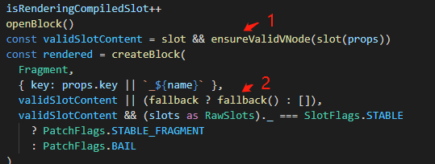

# Vue3插槽（Slot）的实现原理

### Vue官方对插槽的定义

Vue 实现了一套内容分发的 API，这套 API 的设计灵感源自 [Web Components 规范草案](https://github.com/w3c/webcomponents/blob/gh-pages/proposals/Slots-Proposal.md)，将 `<slot>` 元素作为承载分发内容的出口。 

### Slot到底是什么

那么slot到底是什么呢？slot其实是一个接受父组件传过来的插槽内容，然后生成VNode并返回的函数。

我们一般是使用 `<slot></slot>` 这对标签进行接受父组件传过来的内容，那么这对标签最终编译之后是一个创建VNode的函数，我们可以叫做创建插槽VNode的函数。

```javascript
// <slot></slot>标签被vue3编译之后的内容
export function render(_ctx, _cache, $props, $setup, $data, $options) {
  return _renderSlot(_ctx.$slots, "default")
}
```

我们可以清楚看到`<slot></slot>`标签被vue3编译之后的就变成了一个叫`_renderSlot`的函数。

### 如何使用插槽

要使用插槽那就必须存在父子组件。 

假设父组件为一下内容：

```html
<todo-button>
  Add todo
</todo-button>
```

我们在父组件使用了一个`todo-button`的子组件，并且传递了`Add todo`的插槽内容。

todo-button子组件模版内容

```html
<button class="btn-primary">
  <slot></slot>
</button>
```

当组件渲染的时候，`<slot></slot>` 将会被替换为“Add todo”。 

### 回顾组件渲染的原理

那么这其中底层的原理是什么呢？在理解插槽的底层原理之前，我们还需要回顾一下vue3的组件运行原理。

组件的核心是它能够产出一坨VNode。对于 Vue 来说一个组件的核心就是它的渲染函数，组件的挂载本质就是执行渲染函数并得到要渲染的VNode，至于什么data/props/computed 这都是为渲染函数产出 VNode 过程中提供数据来源服务的，最关键的就是组件最终产出的VNode，因为这个才是需要渲染的内容。

### 插槽的初始化原理

vue3在渲染VNode的时候，发现VNode的类型是组件类型的时候，就会去走组件渲染的流程。组件渲染的流程就是首先创建组件实例，然后初始化组件实例，在初始化组件实例的时候就会去处理slot相关的内容。

在源码的runtime-core\src\component.ts里面

 

在函数initSlots里面初始化组件slot的相关内容

那么initSlots函数长啥样，都干了些什么呢？

runtime-core\src\componentSlots.ts 


首先要判断该组件是不是slot组件，那么怎么判断该组件是不是slot组件呢？我们先要回去看一下上面父组件编译之后的代码：

```javascript
export function render(_ctx, _cache, $props, $setup, $data, $options) {
  const _component_todo_button = _resolveComponent("todo-button")
  return (_openBlock(), _createBlock(_component_todo_button, null, {
    default: _withCtx(() => [
      _createTextVNode(" Add todo ")
    ], undefined, true),
    _: 1 /* STABLE */
  }))
}
```

我们可以看到slot组件的children内容是一个Object类型，也就是下面这段代码：

```javascript
{
    default: _withCtx(() => [
      _createTextVNode(" Add todo ")
    ], undefined, true),
    _: 1 /* STABLE */
}
```

那么在创建这个组件的VNode的时候，就会去判断它的children是不是Object类型，如果是Object类型那么就往该组件的VNode的shapeFlag上挂上一个slot组件的标记。

如果是通过模板编译过来的那么就是标准的插槽children,是带有`_`属性的，是可以直接放在组件实例上的slots属性。

如果是用户自己写的插槽对象，那么就没有`_`属性，那么就需要进行规范化处理，走`normalizeObjectSlots` 。

如果用户搞骚操作不按规范走，那么就走`normalizeVNodeSlots`流程。

### 解析插槽中的内容

我们先看看子组件编译之后的代码：

```javascript
export function render(_ctx, _cache, $props, $setup, $data, $options) {
  return (_openBlock(), _createElementBlock("button", { class: "btn-primary" }, [
    _renderSlot(_ctx.$slots, "default")
  ]))
}
```

上面我们也讲过了`<slot></slot>`标签被vue3编译之后的就变成了一个叫`_renderSlot`的函数。

 

`renderSlot`函数接受五个参数，第一个是实例上的插槽函数对象`slots`，第二个是插槽的名字，也就是将插槽内容渲染到指定位置 ，第三个是插槽作用域接收的`props`，第四个是插槽的默认内容渲染函数，第五个暂不太清楚什么意思。

### 作用域插槽原理

作用域插槽是一种子组件传父组件的传参的方式，让插槽内容能够访问子组件中才有的数据 。

子组件模板

```html
<slot username="coboy"></slot>
```

编译后的代码

```javascript
export function render(_ctx, _cache, $props, $setup, $data, $options) {
  return _renderSlot(_ctx.$slots, "default", { username: "coboy" })
}
```

父组件模板

```html
<todo-button>
    <template v-slot:default="slotProps">
        {{ slotProps.username }}
    </template>
</todo-button>
```

编译后的代码

```javascript
export function render(_ctx, _cache, $props, $setup, $data, $options) {
  const _component_todo_button = _resolveComponent("todo-button")

  return (_openBlock(), _createBlock(_component_todo_button, null, {
    default: _withCtx((slotProps) => [
      _createTextVNode(_toDisplayString(slotProps.username), 1 /* TEXT */)
    ]),
    _: 1 /* STABLE */
  }))
}
```

上面讲过renderSlot函数，可以简单概括成下面的代码

```javascript
export function renderSlots(slots, name, props) {
  const slot = slots[name]
  if (slot) {
    if (typeof slot === 'function') {
      return createVNode(Fragment, {}, slot(props))
    }
  }
}
```

slots是组件实例上传过来的插槽内容，其实就是这段内容

```javascript
{
    default: _withCtx((slotProps) => [
      _createTextVNode(_toDisplayString(slotProps.username), 1 /* TEXT */)
    ]),
    _: 1 /* STABLE */
}
```

name是default，那么slots[name]得到的就是下面这个函数

```javascript
_withCtx((slotProps) => [
      _createTextVNode(_toDisplayString(slotProps.username), 1 /* TEXT */)
])
```

slot(props)就很明显是slot({ username: "coboy" })，这样就把子组件内的数据传到父组件的插槽内容中了。

### 具名插槽原理

有时我们需要多个插槽。例如对于一个带有如下模板的 `<base-layout>` 组件： 

```html
<div class="container">
  <header>
    <!-- 我们希望把页头放这里 -->
  </header>
  <main>
    <!-- 我们希望把主要内容放这里 -->
  </main>
  <footer>
    <!-- 我们希望把页脚放这里 -->
  </footer>
</div>
```

对于这样的情况，`<slot>` 元素有一个特殊的 attribute：`name`。通过它可以为不同的插槽分配独立的 ID，也就能够以此来决定内容应该渲染到什么地方： 

```html
<!--子组件-->
<div class="container">
  <header>
    <slot name="header"></slot>
  </header>
  <main>
    <slot></slot>
  </main>
  <footer>
    <slot name="footer"></slot>
  </footer>
</div>
```

一个不带 `name` 的 `<slot>` 出口会带有隐含的名字“default”。 

在向具名插槽提供内容的时候，我们可以在一个 `<template>` 元素上使用 `v-slot` 指令，并以 `v-slot` 的参数的形式提供其名称： 

```html
<!--父组件-->
<base-layout>
  <template v-slot:header>
    <h1>header</h1>
  </template>

  <template v-slot:default>
    <p>default</p>
  </template>

  <template v-slot:footer>
    <p>footer</p>
  </template>
</base-layout>
```

父组件编译之后的内容：

```javascript
export function render(_ctx, _cache, $props, $setup, $data, $options) {
  const _component_base_layout = _resolveComponent("base-layout")

  return (_openBlock(), _createBlock(_component_base_layout, null, {
    header: _withCtx(() => [
      _createElementVNode("h1", null, "header")
    ]),
    default: _withCtx(() => [
      _createElementVNode("p", null, "default")
    ]),
    footer: _withCtx(() => [
      _createElementVNode("p", null, "footer")
    ]),
    _: 1 /* STABLE */
  }))
}
```

子组件编译之后的内容：

```javascript
export function render(_ctx, _cache, $props, $setup, $data, $options) {
  return (_openBlock(), _createElementBlock("div", { class: "container" }, [
    _createElementVNode("header", null, [
      _renderSlot(_ctx.$slots, "header")
    ]),
    _createElementVNode("main", null, [
      _renderSlot(_ctx.$slots, "default")
    ]),
    _createElementVNode("footer", null, [
      _renderSlot(_ctx.$slots, "footer")
    ])
  ]))
}
```

通过子组件编译之后的内容我们可以看到这三个slot渲染函数

`_renderSlot(_ctx.$slots, "header")`

`_renderSlot(_ctx.$slots, "default")`

`_renderSlot(_ctx.$slots, "footer")`

然后我们再回顾一下renderSlot渲染函数

```javascript
// renderSlots的简化
export function renderSlots(slots, name, props) {
  const slot = slots[name]
  if (slot) {
    if (typeof slot === 'function') {
      return createVNode(Fragment, {}, slot(props))
    }
  }
}
```

这个时候我们就可以很清楚的知道所谓具名函数是通过renderSlots渲染函数的第二参数去定位要渲染的父组件提供的插槽内容。父组件的插槽内容编译之后变成了一个object的数据类型。

```javascript
{
    header: _withCtx(() => [
      _createElementVNode("h1", null, "header")
    ]),
    default: _withCtx(() => [
      _createElementVNode("p", null, "default")
    ]),
    footer: _withCtx(() => [
      _createElementVNode("p", null, "footer")
    ]),
    _: 1 /* STABLE */
}
```

### 默认内容插槽的原理

我们可能希望这个 `<button>` 内绝大多数情况下都渲染“Submit”文本。为了将“Submit”作为备用内容，我们可以将它放在 `<slot>` 标签内 

```html
<button type="submit">
  <slot>Submit</slot>
</button>
```

现在当我们在一个父级组件中使用 `<submit-button>` 并且不提供任何插槽内容时： 

```html
<submit-button></submit-button>
```

备用内容“Submit”将会被渲染： 

```html
<button type="submit">
  Submit
</button>
```

但是如果我们提供内容： 

```html
<submit-button>
  Save
</submit-button>
```

则这个提供的内容将会被渲染从而取代备用内容： 

```html
<button type="submit">
  Save
</button>
```

这其中的原理是什么呢？我们先来看看上面默认内容插槽编译之后的代码

```javascript
export function render(_ctx, _cache, $props, $setup, $data, $options) {
  return (_openBlock(), _createElementBlock("button", { type: "submit" }, [
    _renderSlot(_ctx.$slots, "default", {}, () => [
      _createTextVNode("Submit")
    ])
  ]))
}
```

我们可以看到插槽函数的内容是这样的

```javascript
_renderSlot(_ctx.$slots, "default", {}, () => [
    _createTextVNode("Submit")
])
```

我们再回顾看一下renderSlot函数

`renderSlot`函数接受五个参数，第四个是插槽的默认内容渲染函数。

 

再通过renderSlot函数的源码我们可以看到，

第一步，先获取父组件提供的内容插槽的内容，

第二步，如果父组件有提供插槽内容则使用父组件提供的内容插槽，没有则执行默认内容渲染函数得到默认内容。