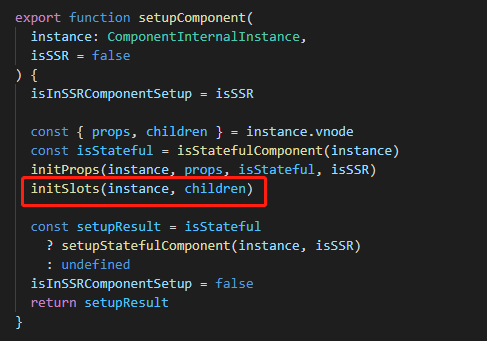
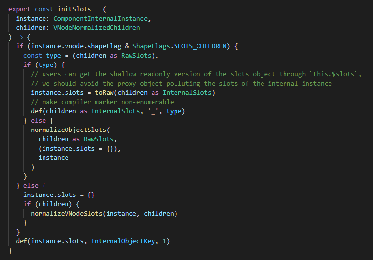
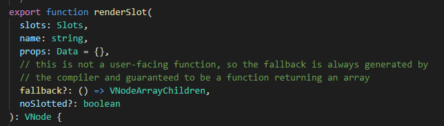

# vue3插槽（slot）的底层原理

### Vue官方对插槽的定义

Vue 实现了一套内容分发的 API，这套 API 的设计灵感源自 [Web Components 规范草案](https://github.com/w3c/webcomponents/blob/gh-pages/proposals/Slots-Proposal.md)，将 `<slot>` 元素作为承载分发内容的出口。 

### slot到底是什么

那么slot到底是什么呢？slot其实是一个接受父组件传过来的插槽内容，然后生成VNode并返回的函数。

我们一般是使用 `<slot></slot>` 这对标签进行接受父组件传过来的内容，那么这对标签最终编译之后是一个创建VNode的函数，我们可以叫做创建插槽VNode的函数。

```javascript
// <slot></slot>标签被vue3编译之后的内容
export function render(_ctx, _cache, $props, $setup, $data, $options) {
  return _renderSlot(_ctx.$slots, "default")
}
```

我们可以清楚看到`<slot></slot>`标签被vue3编译之后的就变成了一个叫`_renderSlot`的函数。

### 如何使用插槽

要使用插槽那就必须存在父子组件。 

假设父组件为一下内容：

```html
<todo-button>
  Add todo
</todo-button>
```

我们在父组件使用了一个`todo-button`的子组件，并且传递了`Add todo`的插槽内容。

todo-button子组件模版内容

```html
<button class="btn-primary">
  <slot></slot>
</button>
```

当组件渲染的时候，`<slot></slot>` 将会被替换为“Add todo”。 

### 回顾组件渲染的流程

那么这其中底层的原理是什么呢？在理解插槽的底层原理之前，我们还需要回顾一下vue3的组件运行原理。

vue3在渲染VNode的时候，发现VNode的类型是组件类型的时候，就会去走组件渲染的流程。组件渲染的流程就是首先创建组件实例，然后初始化组件实例，在初始化组件实例的时候就会去处理slot相关的内容。

在源码的runtime-core\src\component.ts里面

 

在函数initSlots里面初始化组件slot的相关内容

那么initSlots函数长啥样，都干了些什么呢？

runtime-core\src\componentSlots.ts 



首先要判断该组件是不是slot组件，那么怎么判断该组件是不是slot组件呢？我们先要回去看一下上面父组件编译之后的代码：

```javascript
export function render(_ctx, _cache, $props, $setup, $data, $options) {
  const _component_todo_button = _resolveComponent("todo-button")
  return (_openBlock(), _createBlock(_component_todo_button, null, {
    default: _withCtx(() => [
      _createTextVNode(" Add todo ")
    ], undefined, true),
    _: 1 /* STABLE */
  }))
}
```

我们可以看到slot组件的children内容是一个Object类型，那么在创建这个组件的VNode的时候，就会去判断它的children是不是Object类型，如果是Object类型那么就往该组件的VNode的shapeFlag上挂上一个slot组件的标记。

如果是通过模板编译过来的那么就是标准的插槽children,是带有`_`属性的，是可以直接放在组件实例上的slots属性。

如果是用户自己写的插槽对象，那么就没有`_`属性，那么就需要进行规范化处理，走`normalizeObjectSlots` 。

如果用户搞骚操作不按规范走，那么就走`normalizeVNodeSlots`流程。

### 解析插槽中的内容

我们先看看子组件编译之后的代码：

```javascript
export function render(_ctx, _cache, $props, $setup, $data, $options) {
  return (_openBlock(), _createElementBlock("button", { class: "btn-primary" }, [
    _renderSlot(_ctx.$slots, "default")
  ]))
}
```

上面我们也讲过了`<slot></slot>`标签被vue3编译之后的就变成了一个叫`_renderSlot`的函数。

 

`renderSlot`函数接受五个参数，第一个是实例上的插槽函数对象`slots`，第二个是插槽的名字，也就是将插槽内容渲染到指定位置 ，第三个是插槽作用域接收的`props`，第四个是插槽的默认内容渲染函数，第五个暂不太清楚什么意思。

### 作用域插槽

作用域插槽是一种子组件传父组件的传参的方式，解决了普通slot在parent中无法访问child数据的去问题。

子组件模板

```html
<slot username="coboy"></slot>
```

编译后的代码

```javascript
export function render(_ctx, _cache, $props, $setup, $data, $options) {
  return _renderSlot(_ctx.$slots, "default", { username: "coboy" })
}
```

父组件模板

```html
<todo-button>
    <template v-slot:default="slotProps">
        {{ slotProps.username }}
    </template>
</todo-button>
```

编译后的代码

```javascript
export function render(_ctx, _cache, $props, $setup, $data, $options) {
  const _component_todo_button = _resolveComponent("todo-button")

  return (_openBlock(), _createBlock(_component_todo_button, null, {
    default: _withCtx((slotProps) => [
      _createTextVNode(_toDisplayString(slotProps.username), 1 /* TEXT */)
    ]),
    _: 1 /* STABLE */
  }))
}
```

