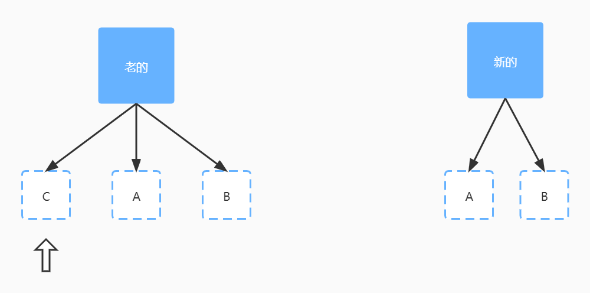
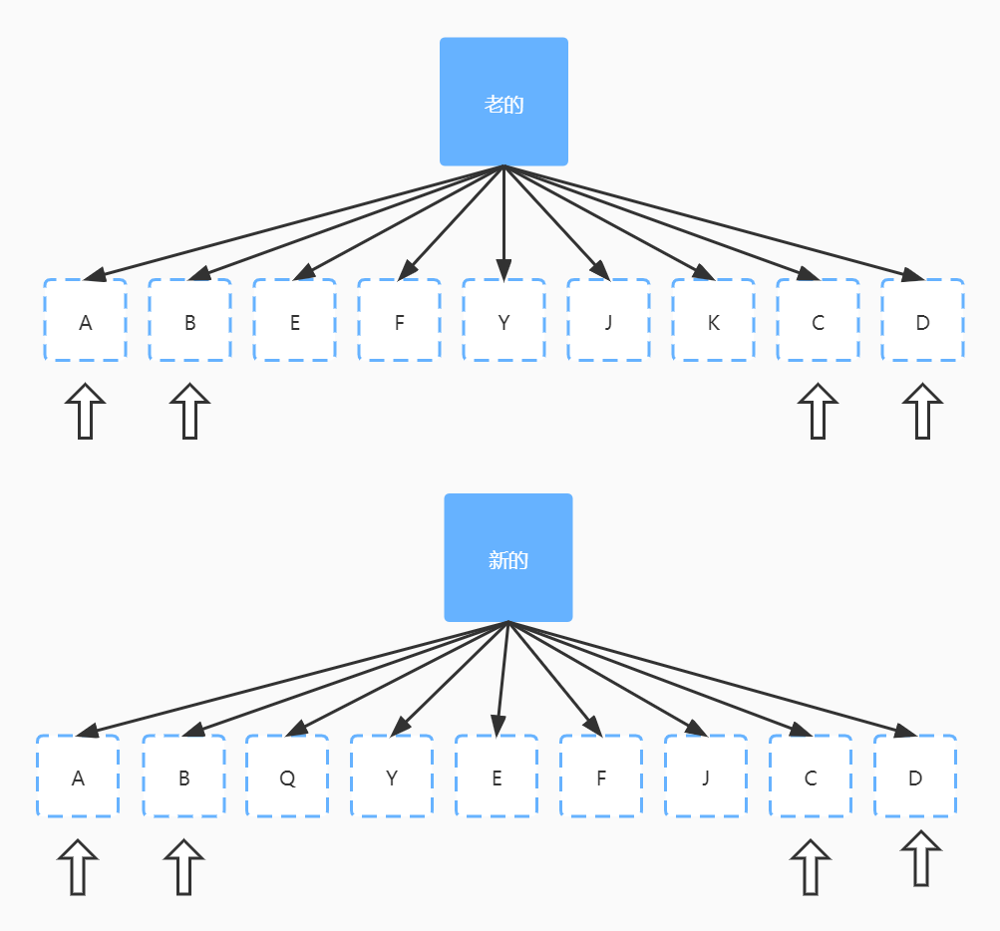
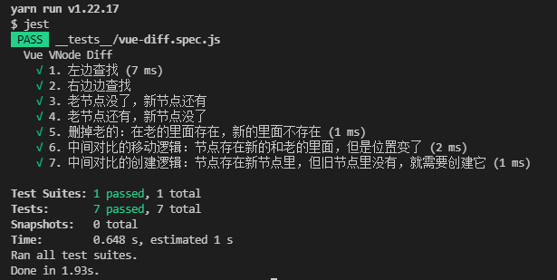

# 根据大崔哥的mini-vue来理解vue中的diff算法

数组类型之间的对比采用的算法叫双端对比算法，所谓双端对比算法就是先看左侧，看完左侧看右侧，然后锁定中间乱序的部分。目的就是为了锁定中间乱序的部分，为什么要采用这种算法呢？因为在我们前端这个应用来说，很多时候我们去操作DOM的时候，很有可能只是改变其中某一个元素，有可能是删除它，有可能是添加它，有可能是移动一下位置，而两边的元素根本没有发生变化，如果我们去遍历所有的节点的话，这个操作是一个O(n)的时间复杂度。而通过双端对比去缩小范围，这样n就会变小，很明显就会提高我们的性能。所以这种双端对比算法只是针对前端这种特定的场景来实现的一种算法。

双端对比算法的核心就是筛选出中间乱序的部分。

### 先处理左侧

 

先从左侧开始进行对比，很明显左侧的A、B都是相同的，然后锁定左侧相同的部分，处理右侧乱序部分。

### 再处理右侧

 

从右侧开始对比，很明显右侧的B、C都是相同的，然后锁定右侧相同部分，处理左侧乱序部分。

### 新的比老的长，创建

左侧一样，把新创建的添加到尾部

 

可以看到新的比老的多，新的多了一个D，多出来的这个节点就需要创建并添加到尾部

从右侧进行对比

  

可以看到新的左侧多了一个E，这里和左侧对比不同之处是这里需要把新元素添加到头部

老的比新的长，删除

 

从右侧开始对比

 


除了上面这几种比较简单的场景意外，最复杂的就是中间对比了。

### 中间对比

 

- 创建新的（Q）：在老的里面不存在，新的里面存在
- 删掉老的（K）：在老的里面存在，新的里面不存在
- 移动（Y、J）：节点存在新的和老的里面，但是位置变了

以上就是双端对比算法需要处理的所有场景了。

用代码模拟实现

```javascript
const prevVNode = [{ key: "a" }, { key: "b" }, { key: "c" }]
const nextVNode = [{ key: "a" }, { key: "b" }, { key: "d" }, { key: "e" }]
```

假如我们有上面两组新老虚拟DOM数据，那么怎么实现对比呢？通过上面的了解我们知道双端对比算法的核心是找出乱序的部分。我们可以通过三个指针来实现：

- 指针`e1`为 `prevVNode`的最后一位元素的索引值
- 指针`e2`为 `nextVNode`的最后一位元素的索引值
- 指针`i`为从左侧开始新老`VNode`元素不相等时的索引值，一开始`i`为0，只要新老元素相等i就往后移，也就是`i++`，然后再去匹配下一对新老元素是否相等，一样的话继续往后走，即继续`i++`，直到新老元素不一样的时候`i`就固定下来了。比如上面的`prevVNode`和`nextVNode`不相等的元素是从`c、d`开始，`c、d`的索引值都是2
- 循环条件是`i`不能大于`e1`并且也不能大于`e2`，很明显大于的话就超出索引了，获取不到元素了


代码模拟

### 从左边往右查找

从左边往右查找，如果节点可以复用，则继续往右，不能就停止循环

```javascript
exports.vueDiff = (c1, c2, { mountElement, patch, unmount, move }) => {
    function isSameVnodeType(n1, n2) {
        return n1.key === n2.key; //&& n1.type === n2.type;
    }
    let i = 0
    let e1 = c1.length - 1
    let e2 = c2.length - 1
    // *1. 从左边往右查找，如果节点可以复用，则继续往右，不能就停止循环
    while(i <= e1 && i <= e2) { // 通过上面分析我们可以知道循环条件
        // 取出新老元素
        const n1 = c1[i]
        const n2 = c2[i]
        // 对比是否一样
        if(isSameVnodeType(n1, n2)) {
            // 一样就递归调用
            patch(n1.key)
        } else {
            // 如果不一样就退出循环
            break
        }
        i ++ // 指针往后移动
    }
}
```

左边查找的测试用例

```javascript
  it('1. 左边查找', () => {
    const mountElement = jest.fn()
    const patch = jest.fn()
    const unmount = jest.fn()
    const move = jest.fn()
    const { vueDiff } = require('../vue-diff')
    vueDiff(
      [{ key: 'a' }, { key: 'b' }, { key: 'c' }],
      [{ key: 'a' }, { key: 'b' }, { key: 'd' }, { key: 'e' }],
      {
        mountElement,
        patch,
        unmount,
        move
      }
    )
    // 第一次调用次数
    expect(patch.mock.calls.length).toBe(2)
    // 第一次调用的第一个参数
    expect(patch.mock.calls[0][0]).toBe('a')
    expect(patch.mock.calls[1][0]).toBe('b')
  })
```

执行测试

 

通过上面的操作我们就把左侧的`i`的值给确认好了，以及左侧相同的元素也进行了递归patch处理了，接下来我们实现右侧的部分

### 从右边往左边查找

```javascript
const prevVNode = [{ key: "a" }, { key: "b" }, { key: "c" }]
const nextVNode = [{ key: "d" }, { key: "e" }, { key: "b" }, { key: "c" }]
```

从上面两组新老元素可以看出，一开始从左边开始对比的时候，`a`和`d`就不相同，就退出循环了，这样指针`i`就定在0，接下来就会去看右侧，右侧也是需要一一进行对比的，就会发现右侧一开始的`c`和`c`是相同的，所以指针`e1`和`e2`就往左移动，然后发现`b`和`b`还是相同，继续往左移动，这个时候就发现`a`和`e`是不相同的，然后就退出循环，指针停止移动，循环条件依然是`i`不能大于`e1`并且也不能大于`e2`

从右边往左边查找，如果节点可以复用，则继续往左，不能就停止循环 

```javascript
// *2. 从右边往左边查找，如果节点可以复用，则继续往左，不能就停止循环
while(i <= e1 && i <= e2) {
    // 取出新老元素
    const n1 = c1[e1]
    const n2 = c2[e2]
    // 对比是否一样
    if(isSameVnodeType(n1, n2)) {
        // 一样就递归调用
        patch(n1.key)
    } else {
        // 如果不一样就退出循环
        break
    }
    // 指针移动
    e1--
    e2--
}
```

右侧测试用例

```javascript
it('2. 右边边查找', () => {
    const mountElement = jest.fn()
    const patch = jest.fn()
    const unmount = jest.fn()
    const move = jest.fn()
    const { vueDiff } = require('../vue-diff')
    vueDiff(
        [{ key: 'a' }, { key: 'b' }, { key: 'c' }],
        [{ key: 'd' }, { key: 'e' }, { key: 'b' }, { key: 'c' }],
        {
            mountElement,
            patch,
            unmount,
            move
        }
    )
    expect(patch.mock.calls.length).toBe(2)
    expect(patch.mock.calls[0][0]).toBe('c')
    expect(patch.mock.calls[1][0]).toBe('b')
})
```

执行测试用例

 

老节点没了，新节点还有 

```javascript
const prevVNode = [{ key: "a" }, { key: "b" }]
const nextVNode = [{ key: "a" }, { key: "b" }, { key: "c" }]
```

首先还是从左侧开始对比，`a`和`a`对比，`b`和`b`对比，走到`c`的时候，指针`i`停下来了，这个时候`i=2`；指针`e1=1`；指针`e2=2` ;这个时候乱序的范围就是`i`大于`e1`小于等于`e2`

```javascript
// *3. 老节点没了，新节点还有
if(i > e1) {
    if(i <= e2) {
        // 新节点可能存在多个，所以需要循环
        while (i <= e2) {
            const n2 = c2[i];
            mountElement(n2.key);
            i++;
        }
    }
}
```

需要注意的是，vue这里插入元素使用的是 `inserBefore` 这个DOM API

参数

- `newNode`：将要插入的节点
- `referenceNode`：被参照的节点（即要插在该节点之前）

所以我们需要计算`被参照的节点`

```javascript
const nextPos = i + 1
const anchor = nextPos < l2 ? c2[nextPos].el : null
```


测试用例

```javascript
it("3. 老节点没了，新节点还有", () => {
    const mountElement = jest.fn();
    const patch = jest.fn();
    const unmount = jest.fn();
    const move = jest.fn();
    const { vueDiff } = require("../vue-diff");
    vueDiff(
        [{ key: "a" }, { key: "b" }],
        [{ key: "a" }, { key: "b" }, { key: "c" }],
        {
            mountElement,
            patch,
            unmount,
            move,
        }
    );
    expect(patch.mock.calls.length).toBe(2);
    expect(patch.mock.calls[0][0]).toBe("a");
    expect(patch.mock.calls[1][0]).toBe("b");
    expect(mountElement.mock.calls[0][0]).toBe("c");
});
```

执行测试用例

 

老节点还有，新节点没了 

```javascript
const prevVNode = [{ key: "a" }, { key: "b" }, { key: "c" }]
const nextVNode = [{ key: "a" }, { key: "b" }]
```

首先还是从左侧开始对比，`a`和`a`对比，`b`和`b`对比，走到`c`的时候，指针`i`停下来了，这个时候`i=2`；指针`e1=2`；指针`e2=1` ;这个时候当这个`i`大于`e2`的时候，就会多出节点，就要删除。

```javascript
 else if(i > e2) {
     while(i <= e1) {
         const n1 = c1[i];
         unmount(n1.key);
         i++;
     }
 }
```

测试用例

```javascript
it("4. 老节点还有，新节点没了", () => {
    const mountElement = jest.fn();
    const patch = jest.fn();
    const unmount = jest.fn();
    const move = jest.fn();
    const { vueDiff } = require("../vue-diff");
    vueDiff(
        [{ key: "a" }, { key: "b" }, { key: "c" }],
        [{ key: "a" }, { key: "b" }],
        {
            mountElement,
            patch,
            unmount,
            move,
        }
    );
    // 第一次调用次数
    expect(patch.mock.calls.length).toBe(2);
    // 第一次调用的第一个参数
    expect(patch.mock.calls[0][0]).toBe("a");
    expect(patch.mock.calls[1][0]).toBe("b");
    expect(unmount.mock.calls[0][0]).toBe("c");
});
```

执行测试用例

 


### 中间对比的删除逻辑

 

- 删掉老的（K）：在老的里面存在，新的里面不存在

怎么确定K需要删除呢？

我们要确定是否需要删除K，那么就需要遍历新节点看看K是否在新节点里面，这时我们就可以看出双端对比算法的优势了，先已经把两边的相等的元素都剔除掉了，再遍历的时候，需要遍历的元素就变少了。但是还是需要遍历，且时间复杂度为O(n)，而遍历只是其中一种查找方案，我们还可以通过索引来进行查找，那么通过索引来查找的时间复杂度则为O(1)。

中间对比代码实现解析

```javascript
// 中间对比
let s1 = i // 老节点的开始
let s2 = i // 新节点的开始

// 记录当前中间节点的总数量
const toBePactched = e2 - s2 + 1
// 记录当前处理的数量
let patched = 0

// 新节点的映射表
const keyToNewIndexMap = new Map()
for(let i = s2; i <= e2; i++) {
    const nextChild = c2[i]
    keyToNewIndexMap.set(nextChild.key, i)
}

// 遍历老节点里面的key
for(let i = s1; i <= e1; i++) {
    const prevChild = c1[i]
    // 如果当前处理的数量已经大于当前节点总数，那么旧节点直接删除就可以了
    if(patched >= toBePactched) {
        unmount(prevChild.key)
        continue
    }

    let newIndex
    if(prevChild.key !== null || prevChild.key !== undefined) {
        // 如果用户设置了key那么就去映射表里面查询
        newIndex = keyToNewIndexMap.get(prevChild.key)
    } else {
        // 如果用户没有设置key，那么就遍历所有，时间复杂度为O(n)
        for(let j = s2; j < e2; j++) {
            if(isSameVnodeType(prevChild, c2[j])) {
                newIndex = j
                break
            }
        }
    }
    // 如果在新的节点里面没有找到
    if(newIndex === undefined) {
        // 没有找到就删除
        unmount(prevChild.key)
    } else {
        // 找到就递归调用
        patch(c2[newIndex].key)
        patched++
    }
}
```

测试用例

```javascript
  it('5. 删掉老的：在老的里面存在，新的里面不存在', () => {
    const mountElement = jest.fn()
    const patch = jest.fn()
    const unmount = jest.fn()
    const move = jest.fn()
    const { vueDiff } = require('../vue-diff')
    vueDiff(
      [
        { key: 'a' },
        { key: 'b' },
        { key: 'c' },
        { key: 'd' },
        { key: 'e' },
        { key: 'f' },
        { key: 'g' }
      ],
      [
        { key: 'a' },
        { key: 'b' },
        { key: 'd' },
        { key: 'c' },
        { key: 'f' },
        { key: 'g' }
      ],
      {
        mountElement,
        patch,
        unmount,
        move
      }
    )
    // 第一次调用次数
    expect(patch.mock.calls.length).toBe(6)
    // 第一次调用的第一个参数
    expect(patch.mock.calls[0][0]).toBe('a')
    expect(patch.mock.calls[1][0]).toBe('b')
    expect(patch.mock.calls[2][0]).toBe('g')
    expect(patch.mock.calls[3][0]).toBe('f')
    expect(patch.mock.calls[4][0]).toBe('c')
    expect(patch.mock.calls[5][0]).toBe('d')
    // e在新的里面没有调用删除
    expect(unmount.mock.calls[0][0]).toBe('e')
    // e在新的里面没有调用删除
    expect(unmount.mock.calls.length).toBe(1)
  })
```

执行测试用例

 

### 中间对比的移动逻辑

 

- 移动（K）：节点存在新的和老的里面，但是位置变了

其实可以进行暴力计算，就是将所有元素进行重新排序移动，但这样性能会造成很大的浪费，如上图其实只需要把节点`K`移动一次就可以了。

那怎么知道只要把节点K移动一次就可以了呢？可以通过一个`最长递增子序列`的算法就可以求出上面的`E`、`F`、`Y`、`J` 是不需要移动的节点。

```javascript
    // 中间对比
    let s1 = i // 老节点的开始
    let s2 = i // 新节点的开始

    // 记录当前中间节点的总数量
    const toBePactched = e2 - s2 + 1
    // 记录当前处理的数量
    let patched = 0

    // 新节点的映射表
    const keyToNewIndexMap = new Map()

    const newIndexToOldIndexMap = new Array(toBePactched) // 创建一个定长数组，定长的数组性能是最好的
    // 是否需要移动
    let moved = false
    let maxNewIndexSoFar = 0
    for (let i = 0; i < toBePactched; i++) newIndexToOldIndexMap[i] = 0

    for (let i = s2; i <= e2; i++) {
      const nextChild = c2[i]
      keyToNewIndexMap.set(nextChild.key, i)
    }
    // 遍历老节点里面的key
    for (let i = s1; i <= e1; i++) {
      const prevChild = c1[i]
      // 如果当前处理的数量已经大于当前节点总数，那么旧节点直接删除就可以了
      if (patched >= toBePactched) {
        unmount(prevChild.key)
        continue
      }

      let newIndex
      if (prevChild.key !== null || prevChild.key !== undefined) {
        // 如果用户设置了key那么就去映射表里面查询
        newIndex = keyToNewIndexMap.get(prevChild.key)
      } else {
        // 如果用户没有设置key，那么就遍历所有，时间复杂度为O(n)
        for (let j = s2; j < e2; j++) {
          if (isSameVnodeType(prevChild, c2[j])) {
            newIndex = j
            break
          }
        }
      }
      // 如果在新的节点里面没有找到
      if (newIndex === undefined) {
        // 没有找到就删除
        unmount(prevChild.key)
      } else {

        if(newIndex >= maxNewIndexSoFar) {
            maxNewIndexSoFar = newIndex
        } else {
            // 如果旧的节点在新的节点里，前一个索引没有比后面一个索引大就需要移动
            moved = true
        }
        // 0 代表老的节点在新的节点里面是不存在的，所以要 +1
        newIndexToOldIndexMap[newIndex - s2] = i + 1

        // 找到就递归调用
        patch(c2[newIndex].key)
        patched++
      }
    }

    const increasingNewIndexSequence = moved ? getSequence(newIndexToOldIndexMap) : []

    // 因为调用的DOM API 的insertBefore是需要插入到一个元素的前面，所以要使用倒序排列
    let j = increasingNewIndexSequence.length - 1
    for(let i = toBePactched -1; i >= 0; i--) {
      // 求出当前的节点
      const nextIndex = i + s2
      const nextChild = c2[nextIndex]
      // 求出当前锚点
      const anchor = nextIndex + 1 < l2 ? c2[nextIndex + 1] : null
      
      if(moved) { // 需要移动的时候再移动
          if(j < 0 || i !== increasingNewIndexSequence[j]) {
              // 如果不在子序列里面就需要移动位置
              move(nextChild.key, anchor.key)
          } else {
              j--
          }
      }
    }
```

测试用例

```javascript
it('5. 中间对比的移动逻辑：节点存在新的和老的里面，但是位置变了', () => {
    const mountElement = jest.fn()
    const patch = jest.fn()
    const unmount = jest.fn()
    const move = jest.fn()
    const { vueDiff } = require('../vue-diff')
    vueDiff(
        [
            { key: 'a' },
            { key: 'b' },
            { key: 'c' },
            { key: 'd' },
            { key: 'e' },
            { key: 'f' },
            { key: 'g' }
        ],
        [
            { key: 'a' },
            { key: 'b' },
            { key: 'e' },
            { key: 'c' },
            { key: 'd' },
            { key: 'f' },
            { key: 'g' }
        ],
        {
            mountElement,
            patch,
            unmount,
            move
        }
    )
    // 第一次调用次数
    expect(patch.mock.calls.length).toBe(7)
    // 第一次调用的第一个参数
    expect(patch.mock.calls[0][0]).toBe('a')
    expect(patch.mock.calls[1][0]).toBe('b')
    expect(patch.mock.calls[2][0]).toBe('g')
    expect(patch.mock.calls[3][0]).toBe('f')
    expect(patch.mock.calls[4][0]).toBe('c')
    expect(patch.mock.calls[5][0]).toBe('d')
    expect(patch.mock.calls[6][0]).toBe('e')
    // e在新的里面需要移动
    expect(move.mock.calls[0][0]).toBe('e')
    // e需要移动到c的前面
    expect(move.mock.calls[0][1]).toBe('c')
    // e在新的里面需要移动
    expect(move.mock.calls.length).toBe(1)
})
```

执行测试用例

 

### 中间对比的创建逻辑

 

- 创建节点（K）：节点存在新节点里，但旧节点里没有，就需要创建它

创建的代码只需要改动一点点就可以了

```javascript
if(newIndexToOldIndexMap[i] === 0) {// 创建
    mountElement(nextChild.key)
} else if(moved) { // 需要移动的时候再移动
    if(j < 0 || i !== increasingNewIndexSequence[j]) {
        // 如果不在子序列里面就需要移动位置
        move(nextChild.key, anchor.key)
    } else {
        j--
    }
}
```

测试用例

```javascript
it('7. 中间对比的创建逻辑：节点存在新节点里，但旧节点里没有，就需要创建它', () => {
    const mountElement = jest.fn()
    const patch = jest.fn()
    const unmount = jest.fn()
    const move = jest.fn()
    const { vueDiff } = require('../vue-diff')
    vueDiff(
      [
        { key: 'a' },
        { key: 'b' },
        { key: 'c' },
        { key: 'd' },
        { key: 'f' },
        { key: 'g' }
      ],
      [
        { key: 'a' },
        { key: 'b' },
        { key: 'e' },
        { key: 'd' },
        { key: 'c' },
        { key: 'f' },
        { key: 'g' }
      ],
      {
        mountElement,
        patch,
        unmount,
        move
      }
    )
    // 第一次调用次数
    expect(patch.mock.calls.length).toBe(6)
    // 第一次调用的第一个参数
    expect(patch.mock.calls[0][0]).toBe('a')
    expect(patch.mock.calls[1][0]).toBe('b')
    expect(patch.mock.calls[2][0]).toBe('g')
    expect(patch.mock.calls[3][0]).toBe('f')
    expect(patch.mock.calls[4][0]).toBe('c')
    expect(patch.mock.calls[5][0]).toBe('d')
    // e在新的里面需要创建
    expect(mountElement.mock.calls[0][0]).toBe('e')
    // e在新的里面需要创建
    expect(mountElement.mock.calls.length).toBe(1)
  })
```

执行测试用例

 

最后总结：

为了性能最优通过映射表，和最长递增子序列来减送我们的移动次数