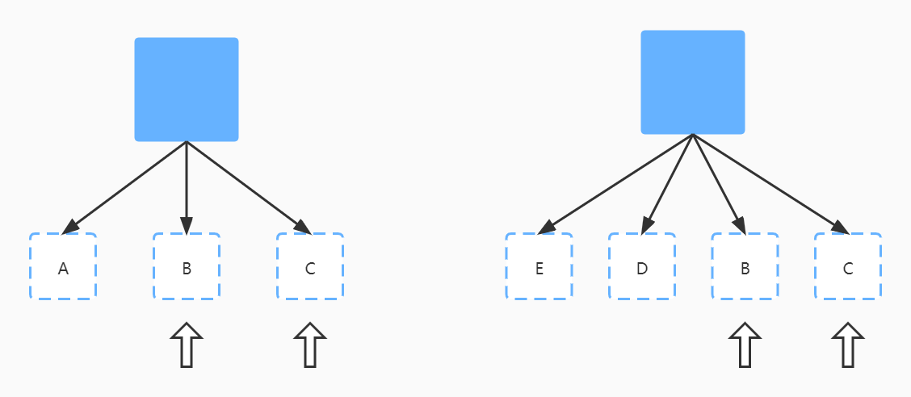
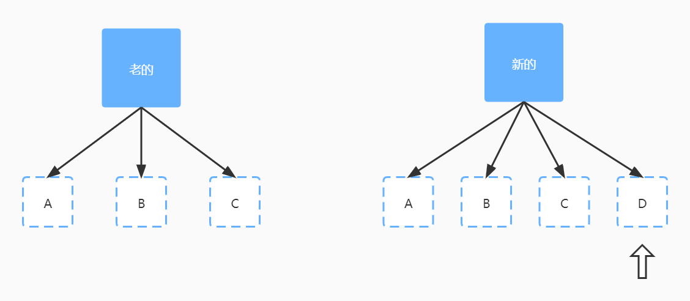

# 根据大崔哥的mini-vue来理解vue中的diff算法

数组类型之间的对比采用的叫双端对比算法，所谓双端对比算法就是先看左侧，看完左侧看右侧，然后锁定中间乱序的部分。目的就是为了锁定中间乱序的部分，为什么要采用这种算法呢？因为在我们前端这个应用来说，很多时候我们去操作DOM的时候，很有可能只是改变其中某一个元素，有可能是删除它，有可能是添加它，有可能是移动一下位置，而两边的元素根本没有发生变化，如果我们去遍历所有的节点的话，这个操作是一个O(n)的时间复杂度。而通过双端对比去缩小范围，这样n就会变小，很明显就会提高我们的性能。所以这种双端对比算法只是针对前端这种特定的场景来实现的一种算法。

双端对比算法的核心就是筛选出中间乱序的部分。

先处理左侧

 

很明显左侧的A、B都是相同的，然后锁定左侧

再处理右侧

 

很明显右侧的B、C都是相同的，然后锁定右侧

新的比老的长，创建

左侧一样，把新创建的添加到尾部

 

可以看到新的比老的多，新的多了一个D，多出来的这个节点就需要创建并添加到尾部

从右侧进行对比

  

